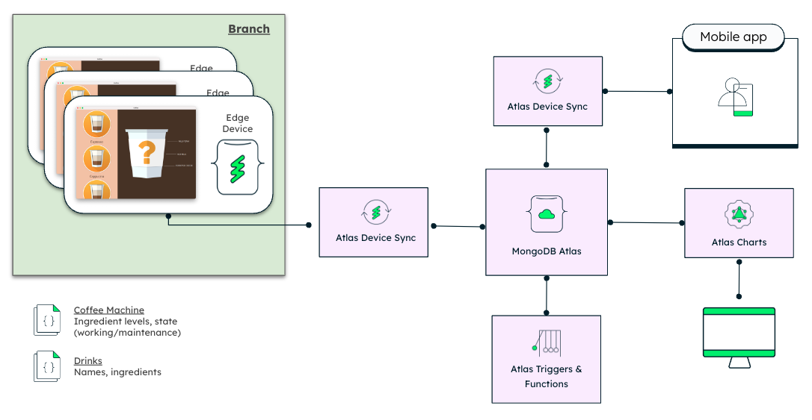

# Coffee Machine - Operated and powered by Atlas Device Sync

The example extends the [Qt provided Coffee Machine](https://doc.qt.io/qt-6/qtdoc-demos-coffee-example.html) with [Atlas Device Sync](https://www.mongodb.com/docs/atlas/app-services/sync/) - essentially turning the coffee machine into a fleet of coffee machines that can be operated and controlled remotely by an operator. 

The animation below shows the Coffee Machine with the Qt/QML UI on the left controlled by the mobile app written in Swift with data displayed on the right hand side with [Atlas Charts](https://www.mongodb.com/docs/charts/).

<div style="display: flex">
  
</div>
&nbsp;

The below diagram shows the setup in highlevel:

<div style="display: flex">
  
</div> 

## Project Structure

This repository contains the source code of the Coffee Machine - the most relevant files are:

```
coffee
├── CMakeLists.txt                  - Barista QML module
├── coffee_manager.cpp              - App ID and sync setup, initial drink list, emit Qt Signals etc.
├── coffee_manager.hpp              - Class definitions with Qt tie-in
├── main.cpp                        - Main initialising the QML app engine
├── main.qml                        - QML main including out of order state
└── realm_models.hpp                - Objects deposited to Realm and synced to MongoDB Atlas
```

## Use Cases

The following use cases are supported:

* **Configuring drink recipes remotely** - the Coffee Machine shows the drink options based on the recipes configured in MongoDB Atlas. The current recipes include espresso, cappuccino and flat white.
* **Out of order sensing and remote control logic** - the control logic on the Atlas side implemented with Atlas Functions checks the availability of the ingredients in the machine needed for the drinks and automatically sets the machine out of order once the level of ingredients drops below the set thresholds.
* **Resiliency to dropped network connection** - consuming the ingredients when serving drinks is deposited to the machine local Realm storage. Once the network is back up, ingredients are synchronized to the Atlas database in cloud.

### Prerequisites: 

- Install the Atlas Device SDK for C++ like so:
```
mkdir build
cd build
cmake -GNinja ..
ninja install
```
- Create a Atlas App Services app then do the following:
    - Enable anonymous authentication.
    - Enable Sync with Development Mode turned on.
- Use the `CMakeLists.txt` file to open the project in Qt Creator.
- Replace `MY_APP_ID` in coffee_manager.cpp with your Atlas App ID.
- Build and run!